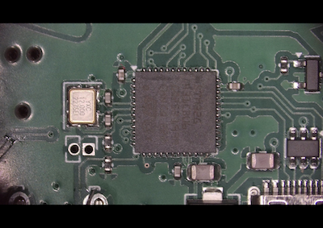
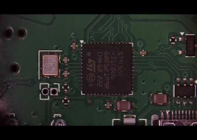

# Polarizer-Illuminator

A microscope illuminator that includes a liquid crystal display as a tunable polarizer. By polarizing the illuminator light, the reflected light can be filtered through a second polarizer (in this case the LCD) with specular reflections and glare removed, depending on the amount of polarization applied (based on bias across LCD). The illuminator is powered over USB PD and can be controlled via a PC for automated control in conjunctions with motorized XY stages and microscope camera. Firmware can be updated over same cable providing power thanks to DFU bootloader, just hold the button on the back and plug into a PC. 

| Non-polarized image | Polarized image |
| --- | --- |
|  |  |